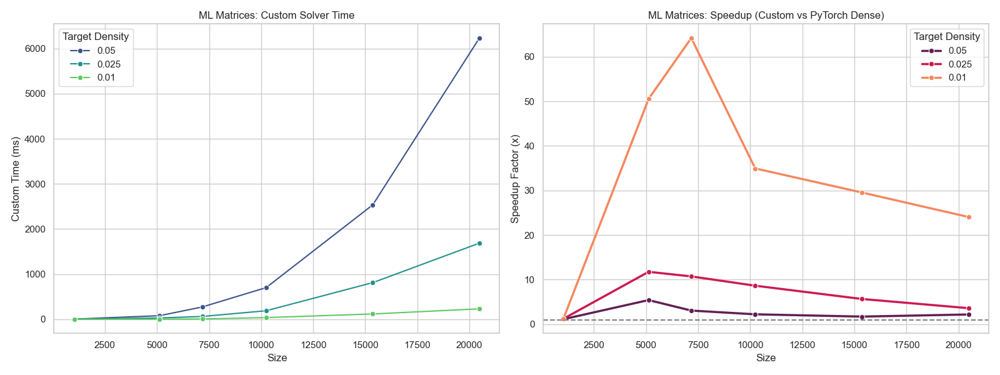
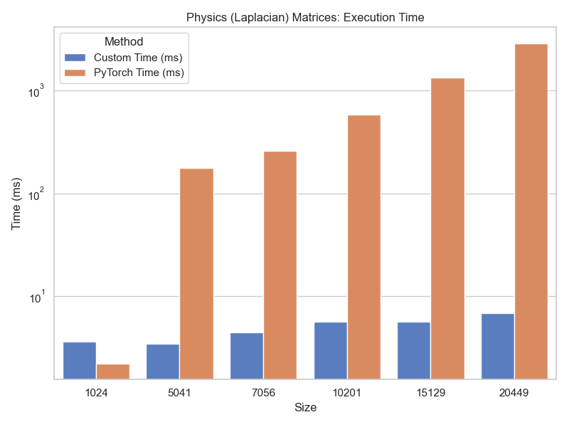
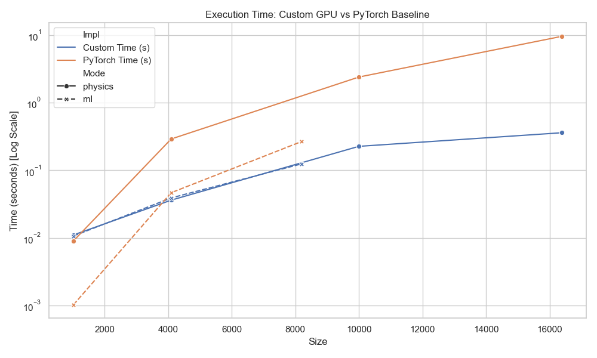

# MPSparse

An implementation of sparse matrix operations using Apple's Metal Performance Shaders. The goal is to build a library which can support QR and LU factorization of sparse matrices 

## Currently Implemented
* CGD (CSR and BCSR)
* BiCGSTAB (CSR and BCSR)
* COO to CSR converter

## TODO
* Test COO to CSR converter, drag race against CUDA impl
* Test SpMV kernel, again vs. CUDA impl
* Implement sparse QR in CUDA (reference)
* Discuss iterative solvers more
* Plug in COO to CSR to torch
* Improve BCSR support

# CGD

This repository implements a high-performance Conjugate Gradient Descent (CGD) solver for sparse linear systems, accelerated by Apple Metal on macOS devices.

It features a custom PyTorch extension that performs Sparse Matrix-Vector multiplication (SpMV) and iterative solver steps entirely on the GPU. By leveraging fused kernels and Metal's SIMD-group functions, this implementation minimizes memory bandwidth usage and CPU-GPU synchronization overhead compared to standard solvers.

## Usage
1. Data Preparation (Key Packing)

The solver accepts input in Coordinate (COO) format. To efficiently sort and convert this to CSR format on the GPU, the row and column indices must be packed into a single 64-bit integer key.

The packing logic places the row index in the high 32 bits and the column index in the low 32 bits.

```python
import torch

def pack_keys(row_indices, col_indices):
    """
    Packs row and column indices into a single uint64 key.
    High 32 bits: Row Index
    Low 32 bits: Col Index
    """
    row_indices = row_indices.to(torch.int64)
    col_indices = col_indices.to(torch.int64)
    return (row_indices << 32) | col_indices
```

2. Running the Solver

Below is an example of initializing the custom tensor and solving $Ax=b$.

```python
import torch
import spmv 

# Define problem size
num_rows = 1024
num_cols = 1024

# Create a sample diagonal matrix (Indices and Values)
rows = torch.arange(num_rows)
cols = torch.arange(num_cols)
values = torch.ones(num_rows, dtype=torch.float32)

# Create RHS vector 'b' and initial guess 'x'
b = torch.randn(num_rows, dtype=torch.float32)
x_solution = torch.zeros(num_cols, dtype=torch.float32)

# Pack keys for the internal sorter
keys = pack_keys(rows, cols)

# Initialize the Metal CSR Tensor
# The constructor handles the COO -> CSR conversion on the GPU
tensor = spmv.csr_tensor(
    keys,           
    values,         
    torch.zeros(num_rows + 1, dtype=torch.int32),     # Buffer for row_ptr
    torch.zeros(keys.shape[0], dtype=torch.int32),    # Buffer for col_ind
    torch.zeros(keys.shape[0], dtype=torch.float32),  # Buffer for sorted values
    num_rows,
    num_cols
)

# Run CGD
# The result is written in-place to x_solution
tensor.cgd(b, x_solution)

print(f"Residual: {torch.norm(values * x_solution - b)}")
```

## Benchmarks

We benchmarked the solver against standard CPU implementations using two distinct matrix topologies:

  1. ML Block-Sparse: Structured sparsity common in pruned machine learning models.

  2. Physics Stencil: 5-point Laplacian stencil common in finite difference simulations.

Performance Results




# BiCGSTAB

This repository implements a high-performance Bi-Conjugate Gradient Stabilized (BiCGSTAB) solver for sparse linear systems, accelerated by Apple Metal on macOS devices.

It features a custom PyTorch extension that performs Sparse Matrix-Vector multiplication (SpMV) and iterative solver steps entirely on the GPU. By leveraging fused kernels, private memory buffering for intermediate vectors, and Metal's SIMD-group functions, this implementation minimizes memory bandwidth usage and CPU-GPU synchronization overhead compared to standard solvers.

## Usage
1. Data Preparation (Key Packing)

The solver accepts input in Coordinate (COO) format. To efficiently sort and convert this to CSR format on the GPU, the row and column indices must be packed into a single 64-bit integer key.

The packing logic places the row index in the high 32 bits and the column index in the low 32 bits.

```python
import torch

def pack_keys(row_indices, col_indices):
    """
    Packs row and column indices into a single uint64 key.
    High 32 bits: Row Index
    Low 32 bits: Col Index
    """
    row_indices = row_indices.to(torch.int64)
    col_indices = col_indices.to(torch.int64)
    return (row_indices << 32) | col_indices
```
2. Running the Solver

Below is an example of initializing the custom tensor and solving Ax=b using the BiCGSTAB method.

```python
import torch
import spmv 

# Define problem size
num_rows = 1024
num_cols = 1024

# Create a sample diagonal matrix (Indices and Values)
# In a real scenario, these would be your sparse matrix indices
rows = torch.arange(num_rows)
cols = torch.arange(num_cols)
values = torch.ones(num_rows, dtype=torch.float32)

# Create RHS vector 'b' and initial guess 'x'
b = torch.randn(num_rows, dtype=torch.float32)
x_solution = torch.zeros(num_cols, dtype=torch.float32)

# Pack keys for the internal sorter
keys = pack_keys(rows, cols)

# Initialize the Metal CSR Tensor
# The constructor handles the COO -> CSR conversion on the GPU
tensor = metal_sparse_extension.csr_tensor(
    keys,           
    values,         
    torch.zeros(num_rows + 1, dtype=torch.int32),     # Buffer for row_ptr
    torch.zeros(keys.shape[0], dtype=torch.int32),    # Buffer for col_ind
    torch.zeros(keys.shape[0], dtype=torch.float32),  # Buffer for sorted values
    num_rows,
    num_cols
)

# Run the BiCGSTAB Iterative Solver
# The result is written in-place to x_solution
tensor.bicgstab(b, x_solution)

# Verification
# Note: For strict verification, you may need to reconstruct the dense matrix
print("Solver complete. Solution stored in x_solution.")
```
## Benchmarks

We benchmarked the solver against standard CPU implementations using two distinct matrix topologies:

1. ML Block-Sparse: Structured sparsity common in pruned machine learning models.

2. Physics Stencil: 5-point Laplacian stencil common in finite difference simulations.



# BCSR Support

## Usage

BCSR support is still in its early stages; currently, the repository has CGD and BiCGSTAB solvers that have been altered to accept the BCSR format. However, one must manually pad the matrix and convert it into BCSR form. In addition, one must make sure that the input and output vectors have been padded. 
```python
def coo_to_metal_bcsr(indices, values, num_rows, num_cols, block_size=4):
    """
    Converts PyTorch COO tensors into Block CSR format using Scipy.
    Handles padding logic automatically.
    """
    # 1. Convert to Scipy BSR
    # This handles the complex logic of densifying blocks and padding
    coo = scipy.sparse.coo_matrix(
        (values.numpy(), (indices[0].numpy(), indices[1].numpy())), 
        shape=(num_rows, num_cols)
    )
    
    # Scipy does the heavy lifting here
    bsr = coo.tobsr(blocksize=(block_size, block_size))
    
    # 2. Extract Flattened Arrays 
    flat_vals = torch.from_numpy(bsr.data.flatten()).float()
    
    # bsr.indptr -> Block Row Pointers
    row_ptr = torch.from_numpy(bsr.indptr).int()
    
    # bsr.indices -> Block Column Indices
    col_ind = torch.from_numpy(bsr.indices).int()
    
    # 3. Calculate Padded Dimensions
    padded_rows = bsr.shape[0]
    padded_cols = bsr.shape[1]
    
    return flat_vals, row_ptr, col_ind, padded_rows, padded_cols

class MetalBCSRSolver:
    def __init__(self, indices, values, rows, cols, block_size=4):
        self.rows = rows
        self.cols = cols
        
        # 1. Convert to BCSR
        b_vals, b_rptr, b_cind, p_rows, p_cols = coo_to_metal_bcsr(
            indices, values, rows, cols, block_size
        )
        
        self.padded_rows = p_rows
        self.padded_cols = p_cols
        
        # 2. Initialize C++ Extension
        dummy = torch.empty(0)
        self.cpp_solver = bcsr.bcsr_tensor(
            dummy,      # keys (unused)
            b_vals,     # dense blocks
            b_rptr,     # row_ptr
            b_cind,     # col_ind
            rows,       # Logical rows
            cols,       # Logical cols
            block_size
        )

    def solve(self, b_vector):
        """
        Solves Ax = b, handling input/output padding safety.
        """

        # We must pad: if logical size is 10 but padded is 12, we must pass 12 to GPU.
        if b_vector.size(0) < self.padded_rows:
            b_padded = torch.zeros(self.padded_rows, dtype=torch.float32)
            b_padded[:self.rows] = b_vector
        else:
            b_padded = b_vector

        x_out = torch.zeros(self.cols, dtype=torch.float32)

        # Run the BiCGSTAB solver
        self.cpp_solver.bicgstab(b_padded, x_out)
        
        return x_out

```

## Benchmarks

We benchmarked the solver against standard CPU implementations using two distinct matrix topologies:

1. ML Block-Sparse: Structured sparsity common in pruned machine learning models.

2. Physics Stencil: 5-point Laplacian stencil common in finite difference simulations.


# Future Steps 

Our COO to CSR conversion occurs on the GPU but takes longer than anticipated, so a major goal is to optimize those kernels. Additionally, the COO to BCSR conversion is currently done manually, so we will also implement that. We also hope to implement adaptive kernels; this will likely take longer and may not happen for a while. Our end goal remains building a direct solver.


